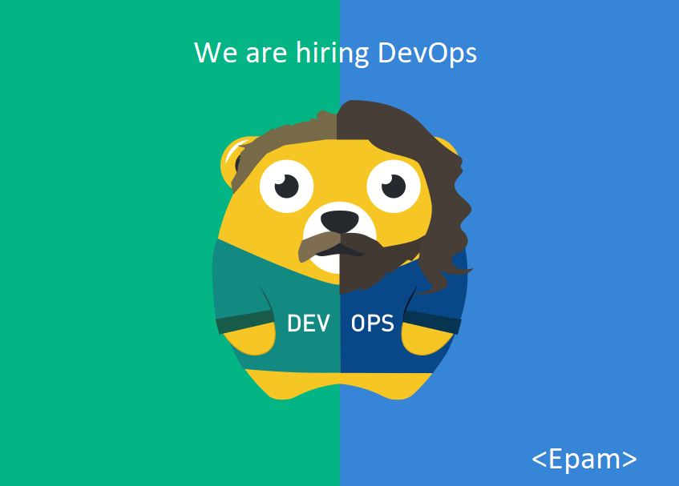

# 🖐️ Hi everyone!

Anna here, I'm a Talent Sourcer, my job is to research different sources and find people with whom we can collaborate. I'm not trying to "hunt" you or sell you anything, we're all human , so let's just get to know each other better. Perhaps our connection will be useful to us in the future :)
And I'm also learning Python 🙂

Im currently looking for professionals to practice Cloud&DevOps in EPAM.
EPAM has offices in 14 Russian cities and 30+ countries, and now we are implementing 3000+ projects, so I have something to offer you. We can discuss vacancies in any location or remotely 🚀.

- DevOps Engineer (Windows/Unix)
- Senior Release Engineer (Linux stack)
- CloudOps (AWS/Azure/GCP)
- DataOps (Kafka, Hadoop, Elasticsearch, NoSQL, SnowFlake, Databricks, Druid)
- Infrastructure Automation Architect (Linux + Clouds)
- DevOps Team Lead
- DevOps/Cloud Solution Architect

## Information
- [10 Things About EPAM](10_Things_About_EPAM.pdf/)
- [Epam office in St. Petersburg](Epam_SPb.pdf/)
- [The global Devops team and the technology stack used](DevOps_Team.pdf/)

𝐃𝐞𝐯𝐎𝐩𝐬 (CatOps and DevMops) and 𝐂𝐥𝐨𝐮𝐝𝐎𝐩𝐬 ☁️ (AWS, Azure, GCP), feel free to contact me: Anna_Malinovskaia@epam.com, Telegram: [@anmalinovskaia](https://t.me/anmalinovskaia), Skype: anmalinovskaja

